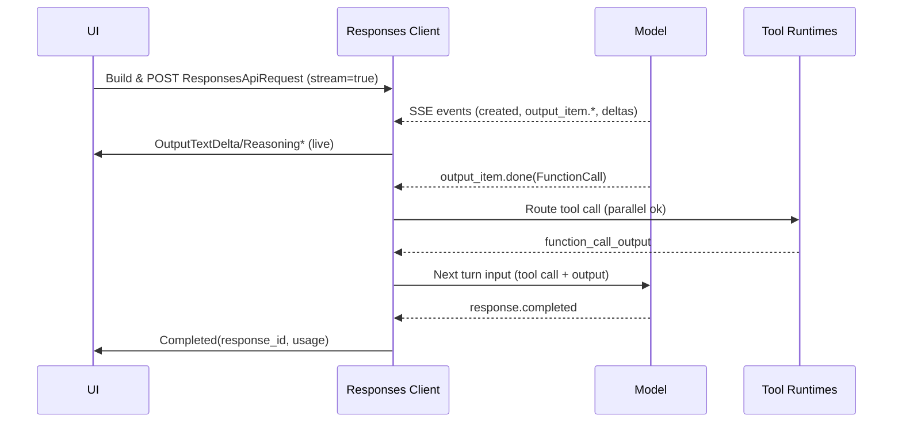

Responses API 架构与集成作业手册（跨项目通用版）

当前电脑的该项目路径: `~/repo/codex`

适用对象

- 需要在任意项目中集成 OpenAI Responses API（或兼容实现）的开发者与 Agent 作者。
- 希望实现“流式输出 + Reasoning 展示 + 工具调用 + MCP Server 互操作”的通用客户端。

内容目标

- 系统性解释 Responses API 的“请求 → 流式事件 → 工具调用 → 回传 → 下一轮”的全生命周期。
- 给出模型无关、语言无关的通用实现建议与伪代码模板。
- 强调关键差异点（与 Chat Completions 的不同、Azure 端点差异、函数参数的字符串 JSON 等）。
- 提供可复用的错误处理、重试、限流、可观测性、与安全性建议。

参考与落地

- 本文大量引用 Codex 的具体实现思路（Rust 版本），对应代码位置仅作为参考；你可以在任意语言/项目中按本文模式落地。
- 参考代码（可选）：
  - 请求构造与发送：codex-rs/core/src/client_common.rs, codex-rs/core/src/client.rs
  - SSE 解析与事件：codex-rs/core/src/client.rs, codex-rs/core/src/client_common.rs
  - 事件消费与回传：codex-rs/core/src/codex.rs, codex-rs/core/src/response_processing.rs
  - 工具编排：codex-rs/core/src/tools/**/*
  - MCP 客户端：codex-rs/core/src/mcp_connection_manager.rs, codex-rs/core/src/mcp_tool_call.rs
  - Responses API 代理：codex-rs/responses-api-proxy

一、请求构造（Responses API）

- 请求载体：`ResponsesApiRequest` 定义请求 JSON 结构（模型、指令、input、tools、stream 等）。
  - 代码：codex-rs/core/src/client_common.rs:266
- 构造位置：`ModelClient::stream_responses()` 负责拼装 payload 与发起 SSE。
  - 代码：codex-rs/core/src/client.rs:187
- 指令拼装：`Prompt::get_full_instructions()` 合成基础指令，必要时拼上 `apply_patch` 说明。
  - 代码：codex-rs/core/src/client_common.rs:20 起相关逻辑
- 输入内容：`Prompt::get_formatted_input()` 会根据是否使用 Freeform 版 apply_patch 对历史 shell 输出再序列化。
  - 代码：codex-rs/core/src/client_common.rs:103
- Reasoning 开关：当模型支持 reasoning summary 时，注入 `reasoning: { effort, summary }`。
  - 代码：codex-rs/core/src/client_common.rs:344（create_reasoning_param_for_request）
- 文本控制（GPT‑5）：`text.verbosity` 与可选 JSON Schema 输出格式。
  - 代码：codex-rs/core/src/client_common.rs:360（create_text_param_for_request）
- include 字段：若启用 reasoning，会在 include 中请求 `reasoning.encrypted_content`。
  - 代码：codex-rs/core/src/client.rs:205
- 会话/线程标识：`prompt_cache_key` 设为 `conversation_id`，保持可恢复线程。
  - 代码：codex-rs/core/src/client.rs:232
- Azure 兼容：Azure Responses 端点不接受 `store: false`，因此设置 `store: true` 并保留 item IDs。
  - 代码：codex-rs/core/src/model_provider_info.rs（Azure 端点识别）
  - 代码：codex-rs/core/src/client.rs:221（azure_workaround）、codex-rs/core/src/client.rs:240（attach_item_ids）

通用请求示例（带注释）

```bash
POST /v1/responses
Content-Type: application/json
Accept: text/event-stream

{
  "model": "gpt-5-codex",
  "instructions": "<BASE + DEV + USER 指令拼装后的大字符串>",
  "input": [
    { "type": "message", "role": "user", "content": [{"type":"input_text","text":"..."}] },
    { "type": "reasoning", "summary": [{"type":"summary_text","text":"..."}] }
  ],
  "tools": [
    { "type":"function", "name":"shell", "parameters": {"type":"object","properties":{...}} },
    { "type":"function", "name":"mcp__docs__search", "parameters": {...} }
  ],
  "tool_choice": "auto",
  "parallel_tool_calls": true,
  "reasoning": { "effort": "medium", "summary": "detailed" },
  "text": { "verbosity": "low", "format": {"type":"json_schema","strict":true,"schema":{...},"name":"output"}},
  "store": false,
  "stream": true,
  "include": ["reasoning.encrypted_content"],
  "prompt_cache_key": "<conversation_id>"
}
```

要点（可移植）：

- `input` 只能包含 Responses 定义的项（`message`/`reasoning`/`function_call` 等）。
- Function 调用的 `arguments` 在 Responses 中是“字符串化的 JSON”，你的客户端收到后需要再反序列化。
- 仅在需要时发送 `text.format`（JSON Schema 输出），并保持 `strict: true` 以获得更稳定的结构化输出。
- 若供应商是 Azure Responses：`store: true`，并保留/附加各 `input` 的 `id` 字段。

二、SSE 流解析与事件映射

- 事件枚举：`ResponseEvent` 抽象了 Responses SSE 的核心事件流。
  - 代码：codex-rs/core/src/client_common.rs:197
  - 关键成员：
    - `Created`
    - `OutputItemDone(ResponseItem)` 与 `OutputItemAdded(ResponseItem)`
    - `OutputTextDelta(String)`（assistant 文本流）
    - `ReasoningSummaryDelta(String)`（summary 文本流）
    - `ReasoningContentDelta(String)`（raw/详细文本流）
    - `ReasoningSummaryPartAdded`（summary 小节边界）
    - `Completed { response_id, token_usage }`
    - `RateLimits(RateLimitSnapshot)`（响应头解析）
- SSE 解析循环：`process_sse` 将 `eventsource_stream` 解析到上述事件。
  - 代码：codex-rs/core/src/client.rs（见 response.* 分支处理）
  - 重要映射：
    - `response.output_item.done` → 解析为 `ResponseItem`，直接下发 `OutputItemDone`，实现“边产出边处理”。
      - 代码：codex-rs/core/src/client.rs:792 起
    - `response.output_text.delta` → `OutputTextDelta`
      - 代码：codex-rs/core/src/client.rs:804
    - `response.reasoning_summary_text.delta` → `ReasoningSummaryDelta`
    - `response.reasoning_text.delta` → `ReasoningContentDelta`
    - `response.reasoning_summary_part.added` → `ReasoningSummaryPartAdded`
    - `response.completed` → 仅记录 id/usage，真正发送 `Completed` 在 SSE 结束时（Ok(None)）触发，确保完整性。
      - 代码：codex-rs/core/src/client.rs:863 与 741 处流关闭路径
    - `response.failed` → 解析错误体，识别上下文窗口/重试建议等，转为 `CodexErr::Stream(...)`。
  - 空闲超时：长时间无事件将触发 idle 超时错误。
    - 代码：codex-rs/core/src/client.rs（`timeout(idle_timeout, stream.next())`）
- 速率限制快照：从响应头解析两级窗口数据并上报 `RateLimits`。
  - 代码：codex-rs/core/src/client.rs（`parse_rate_limit_snapshot` 系列）

通用 SSE 片段示例

```bash
event: response.created
data: {"type":"response.created","response":{...}}

event: response.output_item.done
data: {"type":"response.output_item.done","item":{"type":"message","role":"assistant","content":[{"type":"output_text","text":"Hello"}]}}

event: response.output_text.delta
data: {"type":"response.output_text.delta","delta":" more..."}

event: response.reasoning_summary_text.delta
data: {"type":"response.reasoning_summary_text.delta","delta":"Plan: ..."}

event: response.reasoning_text.delta
data: {"type":"response.reasoning_text.delta","delta":"Step: ..."}

event: response.completed
data: {"type":"response.completed","response":{"id":"resp_123","usage":{...}}}
```

通用流处理伪代码

```rust
while true:
  evt = next_sse_or_timeout()
  if evt is None: # stream closed
    if saw(response.completed): emit Completed(response_id, usage)
    else: emit StreamError("closed before response.completed")
    break
  switch evt.type:
    case response.output_item.done:
      item = parse(ResponseItem)
      emit OutputItemDone(item)  # 允许 UI/编排即时消费
    case response.output_text.delta:
      emit OutputTextDelta(delta)
    case response.reasoning_summary_text.delta:
      emit ReasoningSummaryDelta(delta)
    case response.reasoning_text.delta:
      emit ReasoningContentDelta(delta)
    case response.reasoning_summary_part.added:
      emit ReasoningSummaryPartAdded
    case response.completed:
      remember(response_id, usage)
    case response.failed:
      parse structured error → emit StreamError(message,retry_after?)
    default:
      ignore or log
```

三、事件消费：文本/Reasoning 流式转发与可视化

- 主循环：`Codex` 在每个 turn 内消费 `ResponseEvent` 并向 UI 发送 `EventMsg`。
  - 代码：codex-rs/core/src/codex.rs:2000 起
- Assistant 文本 delta：
  - `ResponseEvent::OutputTextDelta` → `EventMsg::AgentMessageContentDelta`（需要活跃 item）。
  - 代码：codex-rs/core/src/codex.rs:2156
- Reasoning Summary（概述）流：
  - `ReasoningSummaryDelta` → `EventMsg::ReasoningContentDelta`（需要活跃 item）。
  - 代码：codex-rs/core/src/codex.rs:2172
  - `ReasoningSummaryPartAdded` → `EventMsg::AgentReasoningSectionBreak`（小节边界）。
- Reasoning Raw（细节）流：
  - `ReasoningContentDelta` → `EventMsg::ReasoningRawContentDelta`（需要活跃 item）。
  - 代码：codex-rs/core/src/codex.rs:2191
- 活跃 item 与开始/完成：当非工具类 `ResponseItem` 到达时，发出 `TurnItemStarted/Completed` 方便 UI 标注。
  - 解析：`event_mapping::parse_turn_item` 将 `ResponseItem` 转换为 `TurnItem`（包含 Reasoning 映射逻辑）。
    - 代码：codex-rs/core/src/event_mapping.rs（summary 与 raw_content 提取）

展示建议（可移植）：

- 将 Assistant 文本与 Reasoning Summary 分栏展示；Raw Reasoning（详细）可折叠或仅在调试模式显示。
- `ReasoningSummaryPartAdded` 用作小节分隔（如“Plan / Actions / Checks”）。
- 启用“隐藏内部 reasoning”开关以满足无泄漏场景（例如团队策略要求）。

四、工具调用编排（Function/自定义/本地 Shell）

- ToolSpec 生成：按模型族与特性开关生成 Responses API 兼容的 `tools` JSON（包括 `local_shell`/`shell`/web_search/自定义等）。
  - 代码：codex-rs/core/src/tools/spec.rs（`create_tools_json_for_responses_api`）
- 来自模型的工具触发：
  - `OutputItemDone(ResponseItem::FunctionCall | LocalShellCall | CustomToolCall)`
  - `ToolRouter::build_tool_call()` 解析出具体的调用载荷（普通 Function、自定义文本、统一 exec、本地 shell……）。
    - 代码：codex-rs/core/src/tools/router.rs:37, 68
- 调用执行：
  - `ToolCallRuntime::handle_tool_call(...)` 运行工具（审批/沙箱/并行策略见 runtimes 与 sandboxing）。
  - 成功与失败统一封装为 `ResponseInputItem`，用于“回传给模型”。
    - 代码：codex-rs/core/src/tools/parallel.rs, codex-rs/core/src/tools/runtimes/**/*
- 回传与记录：`process_items()` 会：
  - 将工具触发与对应输出转写进会话历史（以 Responses 兼容的 `ResponseItem::*` 形式）。
  - 汇总 `ResponseInputItem` 作为“下一轮”模型输入的一部分。
  - 代码：codex-rs/core/src/response_processing.rs

关键契约（通用）：

- 触发：模型通过 `response.output_item.done` 发送 `function_call | local_shell_call | custom_tool_call`，包含 `call_id` 与 `arguments`（字符串 JSON）。
- 执行：客户端路由到实际工具实现（可并行）；注意审批与沙箱策略（最小权限、网络与文件访问隔离）。
- 回传：
  - 成功：`function_call_output` 的 `output` 用“纯字符串”，或当有富媒体（如图片）时“数组形式 content_items”。
  - 失败：`function_call_output` 仍是字符串（建议包含错误摘要），可外层标注 `success:false` 供日志使用。
- 关联：下一个 Turn 的 `input` 需包含“工具触发 + 工具回传”这两项，供模型继续推理。

工具输出（带图片）示例（通用）：

```json
// 回传给模型（成功，有富媒体）
{
  "type":"function_call_output",
  "call_id":"call_1",
  "output": [
    {"type":"input_text","text":"caption"},
    {"type":"input_image","image_url":"data:image/png;base64,...."}
  ]
}
```

五、MCP（Model Context Protocol）集成

- 客户端管理：`McpConnectionManager` 为每个已配置的 MCP server 启动一个 `RmcpClient`，并聚合工具清单。
  - 代码：codex-rs/core/src/mcp_connection_manager.rs
  - 工具命名：以 `mcp__{server}__{tool}` 形式限定，必要时附加哈希截断，确保长度与唯一性。
  - 工具过滤：支持 per‑server 的 allowlist/denylist。
  - 超时：独立的启动超时与工具调用超时。
- 工具发现与调用：
  - `list_all_tools()` 暴露合并工具集，供工具定义阶段注入到 `tools` 中。
  - `parse_mcp_tool_name()` 将模型给出的函数名解析回 (server, tool)。
    - 代码：codex-rs/core/src/codex.rs:1232
  - `handle_mcp_tool_call()` 负责：参数 JSON 解析、Begin/End 事件上报、实际 `call_tool()` 调用、将结果编码为 Responses 可接受的 `ResponseInputItem`。
    - 代码：codex-rs/core/src/mcp_tool_call.rs
- Begin/End 事件：
  - `EventMsg::McpToolCallBegin`/`McpToolCallEnd` 包含调用时长、结果或错误，便于 UI 观测。

通用落地步骤：

- 启动每个 MCP client，初始化并列出可用工具；将工具合并注入到 Responses 的 `tools` 列表（按需过滤）。
- 采用“限定名”规则避免命名冲突（推荐 `mcp__{server}__{tool}`，并附加哈希截断确保长度上限）。
- 当模型触发此类工具，解析回 (server, tool)，再调用对应 MCP `call_tool` 并将 `CallToolResult` 转为 Responses 的 `function_call_output`。
- 结合 OAuth 凭证存储策略（内存/系统 keychain/文件），避免明文凭证暴露。

六、工具输出的 Responses 兼容序列化

- 统一载体：`FunctionCallOutputPayload` 兼容两种形态：
  - 纯文本：success 情况下序列化为“纯字符串”。
  - 结构化：当工具返回富文本（如图片 data-url）时，序列化为 `content_items`（数组），内容项为 `input_text`/`input_image`。
  - 代码：codex-rs/protocol/src/models.rs（序列化/反序列化逻辑 + `From<CallToolResult>`）
- MCP 返回的 `CallToolResult` 将被转换为 `FunctionCallOutputPayload`，保留 `content` 原文串，且在有图片时生成 `content_items`（数组）。
  - 代码：codex-rs/protocol/src/models.rs:329 起

七、错误处理与重试

- 初次请求错误：
  - 401（ChatGPT 模式）可触发令牌刷新；非重试型错误包含 body 原文，便于诊断。
  - 429：解析 `usage_limit_reached` / `usage_not_included` 并转成专用错误（含计费窗口重置时间与快照）。
  - 代码：codex-rs/core/src/client.rs:300 起
- 流式重试：
  - `ModelProviderInfo::stream_max_retries()` 控制断流重连次数；`stream_idle_timeout_ms` 控制闲置断连判断。
  - 代码：codex-rs/core/src/model_provider_info.rs
- SSE 末尾一致性：若流关闭前未见 `response.completed`，将抛出 `stream closed before response.completed` 错误。
  - 代码：codex-rs/core/src/client.rs:741 分支；测试见同文件 1073 起

推荐策略（可移植）：

- 初次请求失败：
  - 4xx/5xx 读取 body 并上报到日志/遥测，附 `request_id`（如 `cf-ray`）。
  - 429：解析 `Retry-After` 或从错误信息抽取“Try again in Xs”。
- 流中断/空闲超时：
  - 使用指数退避（上限可配置），并保留幂等上下文（如 `prompt_cache_key`）。
- ChatGPT 模式（会话令牌）可在 401 时自动尝试刷新，失败则向 UI 报错并停止重试。

八、Rate Limits 与遥测

- 响应头到 `RateLimitSnapshot` 的映射并立刻发送 `ResponseEvent::RateLimits`。UI 可用于状态栏展示。
  - 代码：codex-rs/core/src/client.rs（`parse_rate_limit_snapshot`）
- 请求/事件会通过 `OtelEventManager` 记录时序与耗时。

通用建议：

- 在每次建立 SSE 成功后，先解析速率限制响应头并立即发出“RateLimits”事件给上层；便于状态栏或守护进程调度。
- 遥测数据包括：请求开始/结束、SSE 事件延迟、输出 token 与 reasoning token（若可获得）。

九、Responses 代理（可选）

- 目的：在某些前端环境（如 Node 包装）中，使用最小代理隔离 `Authorization`，防止 key 泄露给不可信进程。
- 实现：`codex-responses-api-proxy`（Rust 二进制 + npm 包），仅转发 `POST /v1/responses`，其余一律 403。
  - 代码：codex-rs/responses-api-proxy/src/lib.rs
  - 读取密钥：从 stdin 读取，注入 `Authorization: Bearer …`，并显式设置 `Host`。

通用用法（最小化暴露密钥）：

- 以有权限进程启动代理（stdin 输入秘钥；进程环境中清除 API Key）。
- 业务进程仅访问代理端口，不接触原始 Key；必要时启用 `/shutdown` 受控关闭。
- 如接入 Azure，自定义 `--upstream-url` 指向 Azure Responses 端点。

十、典型一次 Turn 的时序（文字版）

- 组装 `ResponsesApiRequest`（含 tools、reasoning、text 控制、prompt_cache_key）。
- 发送 SSE 请求，收到：
  - 若 `response.output_item.done` 为 assistant 文本/Reasoning：即时透传 delta 到 UI（同时保留活跃 item 以聚合）。
  - 若为工具触发（Function/LocalShell/CustomTool）：构建 ToolInvocation → 运行器执行 → 形成 `ResponseInputItem` 回传项。
- SSE 收到 `response.completed` → 结束时发出 `Completed{ response_id, token_usage }`。
- `process_items()` 将本轮 `ResponseItem`（含工具触发与输出、Reasoning）记录入历史，并返回回传的 `ResponseInputItem[]`。
- 若有回传项，继续下一 Turn；无回传项且无输出，任务结束。

Mermaid（可选，供文档系统渲染）：



十一、Reasoning Summary 与 Raw 内容的落盘/回放

- 落盘：`ResponseItem::Reasoning { summary, content, encrypted_content }` 会被持久记录（当模型返回这些 item 时）。
  - 代码：codex-rs/core/src/response_processing.rs:74 起
- 回放与 UI 转换：
  - `event_mapping::parse_turn_item()` 将 `ResponseItem::Reasoning` 转为 `TurnItem::Reasoning`，把 `summary_text[]` 与 `raw_content[]` 解出（忽略 `ReasoningText` 以外不支持的类型）。
  - 代码：codex-rs/core/src/event_mapping.rs

可移植注意：

- 某些模型/供应商可能仅返回 summary 或仅返回 raw；客户端需要在 UI 层做缺省展示策略。
- `encrypted_content` 可用于安全通道；未支持时应忽略，不应导致解析失败。

十二、配置速查（与 Responses 相关）

- 选择协议：`model_providers.*.wire_api = "responses" | "chat"`
- 流参数：`stream_max_retries`、`stream_idle_timeout_ms`（提供方级别）。
- Reasoning：`model_reasoning_effort`、`model_reasoning_summary`。
- 文本冗长度（GPT‑5）：`model_verbosity`。
- MCP：`mcp_servers`（server 定义、启动超时、工具过滤、OAuth 存储策略）。
- 示例：见 docs/example-config.md（包含 MCP、Responses、Azure、流式重试等注释示例）。

最小配置样例（通用伪配置）：

```toml
[model_providers.openai]
name = "OpenAI"
base_url = "https://api.openai.com/v1"
env_key = "OPENAI_API_KEY"
wire_api = "responses"
request_max_retries = 4
stream_max_retries = 5
stream_idle_timeout_ms = 300000

[mcp_servers.docs]
enabled = true
transport = { type = "stdio", command = "docs-mcp" }
startup_timeout_sec = 10
tool_timeout_sec = 60
```

十三、开发者要点与注意事项

- Function 调用的 `arguments` 在 Responses 中是“字符串中的 JSON”，需按字符串再反序列化。
  - 代码：codex-rs/protocol/src/models.rs:82 注释
- 本地 shell 调用 `LocalShellCall` 的 `call_id | id` 必须存在，否则报错并以失败输出回传。
  - 代码：codex-rs/core/src/tools/router.rs:108 与 codex-rs/core/src/codex.rs:2089 起
- 工具输出序列化差异：成功为纯字符串，结构化/富媒体时为 `content_items[]`；失败时 `success:false`（仍序列化为字符串形式）。
- Azure 端点：`store:true` 且保留 item `id`，否则请求会被拒绝。
- Rate limits：优先解析响应头；429 错误体中也可能包含计划与重置时间。

补充：

- 工具命名约束：Responses 要求 `^[a-zA-Z0-9_-]+$`，MCP 工具需“限定名 + 哈希截断”避免冲突与长度超限。
- `call_id` 必须稳定唯一，用于将后续 `function_call_output` 关联回去。
- 职责边界：
  - 客户端负责：SSE 解析、并发工具编排、回传拼装、错误/重试/超时、可观测性、安全隔离。
  - 模型负责：生成下一步；客户端不应尝试“合成/伪造”工具项。
- 安全：
  - 本地 Shell / Exec 工具必须走审批与沙箱，最小权限原则，默认禁网（除非显式允许）。
  - 图片/数据 URI 在输出中可能很大，需注意内存/速率限制与日志脱敏。

十四、跨项目适配模板（伪代码）

请求端（语言无关）：

```
build_tools := base_tools + mcp_tools()
payload := { model, instructions, input, tools: build_tools, stream: true, ... }
resp := http.post(url, payload, accept: event-stream)

spawn sse_loop(resp.body, on_event)

on_event(evt):
  switch evt:
    case OutputTextDelta/Reasoning*: ui.emit(...)
    case OutputItemDone(item):
      if is_tool_call(item):
        run_tool_async(item, (output) => queue_next_turn(item, output))
      else: ui.emit(item)
    case Completed(id, usage): ui.completed(id, usage)

queue_next_turn(item, output):
  history.append(item)
  history.append(output)
  next_input = history.tail_for_next_turn()
  http.post(stream=true, input=next_input)
```

SSE 解析器：

```
read line-buffered event-stream
for each event:
  parse json {type, item?, delta?, response?}
  map to OutputItemDone/OutputTextDelta/Reasoning*/Completed/Failed
```

MCP 适配器：

```
for each configured server:
  client.spawn(); client.initialize(capabilities)
  tools = client.list_tools(); qualify_and_filter(tools)

dispatch(tool_call):
  (server, tool) = parse_mcp_tool_name(name)
  result = client.call_tool(tool, args)
  return function_call_output(from result)
```

十五、测试与验收

- 单元：
  - SSE 事件解析：各类事件 → 内部事件模型；流关闭未 completed 的错误分支。
  - Function 输出序列化：纯文本 vs content_items（含图片 data URL）。
- 集成：
  - 工具并发与顺序保障；call_id 关联；错误回传路径。
  - MCP 端到端：list_tools → call_tool → result 映射。
- 负载：
  - 大输出（文本/图片）；长时间空闲；断流重连；速率控制。

十六、迁移与兼容（Chat → Responses）

- Chat Completions 的流式是一段“delta 聚合”后在末尾构建完整消息；Responses 则鼓励“边产出边处理”。
- 函数参数：Chat/Responses 都是“字符串 JSON”，但 Responses 有 `output_item.done` 粒度的完整项。
- 若保留 Chat 兼容：可在 Responses 事件层之上实现一个“聚合适配器”，对 UI 只暴露最终消息与工具对话（Codex 已内置）。

十七、术语与约束

- `call_id`：工具调用链路的主关联键，必须在一个响应周期内唯一且稳定。
- 工具名：`^[a-zA-Z0-9_-]+$`，建议在多来源工具（MCP + 本地）场景做限定名与哈希截断。
- `response_id`：`response.completed` 返回；可用于跨会话恢复/分叉线程。
- `prompt_cache_key`：会话/线程键；非规范一部分，但对幂等/恢复有帮助。

十八、附：关键代码参照（可选）

- `ResponsesApiRequest`：codex-rs/core/src/client_common.rs:266
- `ResponseEvent`：codex-rs/core/src/client_common.rs:197
- SSE 处理：codex-rs/core/src/client.rs（response.* 分支）
- 回传与历史：codex-rs/core/src/response_processing.rs
- 工具编排：codex-rs/core/src/tools/**/*
- MCP：codex-rs/core/src/mcp_connection_manager.rs, codex-rs/core/src/mcp_tool_call.rs
- 代理：codex-rs/responses-api-proxy

十四、关键文件索引

- 请求/事件类型
  - `ResponsesApiRequest`：codex-rs/core/src/client_common.rs:266
  - `ResponseEvent`：codex-rs/core/src/client_common.rs:197
  - `ResponseItem`/`ResponseInputItem`/`FunctionCallOutputPayload`：codex-rs/protocol/src/models.rs
- SSE 处理
  - `ModelClient::stream_responses`：codex-rs/core/src/client.rs:187
  - SSE 事件分派：codex-rs/core/src/client.rs（`response.output_item.done` 等分支，约 792 起）
- 主循环与转发
  - `Codex` turn 事件消费：codex-rs/core/src/codex.rs:2000 起
  - 文本/summary/raw delta 转发：codex-rs/core/src/codex.rs:2156, 2172, 2191
  - `process_items`（记录与回传拼装）：codex-rs/core/src/response_processing.rs
- 工具与 MCP
  - ToolSpec 定义与构建：codex-rs/core/src/tools/spec.rs
  - 路由与分发：codex-rs/core/src/tools/router.rs
  - MCP 客户端管理：codex-rs/core/src/mcp_connection_manager.rs
  - MCP 工具调用封装：codex-rs/core/src/mcp_tool_call.rs
- 代理
  - Responses API 代理：codex-rs/responses-api-proxy

附录：实现/扩展建议

- 新增工具：在 `tools/spec.rs` 定义 ToolSpec 与参数 JSON Schema；在 `tools/registry.rs` 注册处理器；在 `handlers/` 实现逻辑。
- 对接第三方模型：添加/覆盖 `ModelProviderInfo`，确保 `wire_api` 与端点一致，必要时实现 Azure 兼容分支。
- UI/Agent 侧：
  - 订阅 `AgentMessageContentDelta`/`ReasoningContentDelta`/`ReasoningRawContentDelta`/`AgentReasoningSectionBreak`，实时渲染输出与 reasoning。
  - 监听 `McpToolCallBegin/End` 便于观察外部工具耗时和结果。
